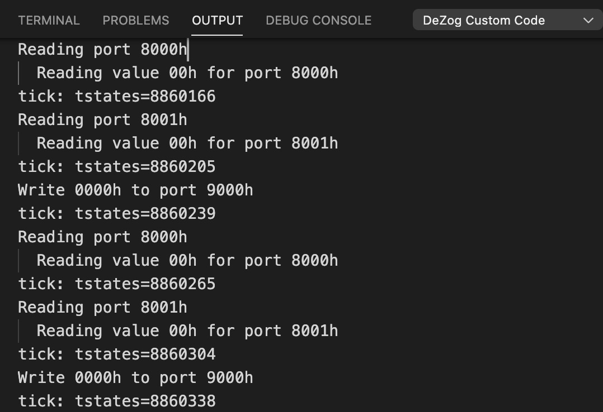

# z80-peripherals-sample

# Introduction

This is a small Z80 assembler program that uses custom javascript code to emulate Z80 ports inside [DeZog (Z80 debugger)](https://github.com/maziac/DeZog).


# Prerequisites

- Visual Studio Code (vscode)
- [DeZog](https://github.com/maziac/DeZog) (>= v2.0.0)
- Z80 Assembler: sjasmplus, https://github.com/z00m128/sjasmplus

The program runs inside the internal Z80 simulator.

This is an "advanced" topic, so it is recommended that you have already some experience with debugging with DeZog.
A more simple sample program (without custom simulation of ports) can be found here: [z80-sample-program](https://github.com/maziac/z80-sample-program).


# Building

First, if you just want to test debugging with the 'DeZog' extension there is no need to build/assemble the required files.
The binaries are included in this repository so that you could also directly start to debug.

However, if you would like to do some changes you need to compile.
From the menu choose "Terminal->Run Build Task..."
tasks.json is configured such that it will call sjasmplus with the required parameters.

There are several .asm files which are all included in the main.asm file. This file is the one being assembled.

After the build is ready a z80-peripherals-sample.obj file is created which can be used with ZEsarUX.


# The Program Itself

The Z80 assembler program is used to demonstrate the simulation of interrupts and
in- and out-ports.

The program itself calculates the addition of 2 binary values.
The result is shown in the ZSimulationView.
Additionally the result can be memorized.
The binary values are input via 2 in-ports, 0x8000 and 0x8001.
The values are added in a loop and output to out-port 0x9000.
Additionally it is possible to generate an interrupt (IM 1, address 0x0038)
to store the result. The stored value is output to 0x9001.

There are 3 parts to this demo:
a) the assembler program which deals with the in- and out-ports and the interrupt. This is all in 'main.asm'
b) the HW simulation code in 'simulation/ports.js'
c) and the UI in 'simulation/ui.html'

Important to note is that the javascript code to simulate the HW ('simulation/ports.js') works
synchronously. I.e. all request from the simulator (e.g. reading a port) have
to be handled immediately so that it does not stop the simulation.

On the other hand the UI ('simulation/ui.html') works asynchronously. It communicates with the HW
simulation code through messages only. No direct function calls.


# Program Flow

Note: To view the sequence charts in markdown you need a viewer that support puml (plantuml). On the github pages you won't see anything useful.


~~~puml
hide footbox
title Main program flow

participant z80 as "main.asm"
participant js as "port.js"
participant dezog as "DeZog"
participant html as "ui.html"

loop
	note over z80: ld bc,0x8000\nin a,(bc)
	z80 -> js: API.readPort(0x8000)
	note over js: Return stored value1
	z80 <-- js: value1

	note over z80: ld e,a\nld bc,0x8001\nin a,(c)
	z80 -> js: API.readPort(0x8001)
	note over js: Return stored value2
	z80 <-- js: value2

    note over z80: add a,e\nld (result),a

    note over z80: ld bc,0x9000\nout (c),a
	z80 -> js: API.writePort(0x9000)
	note over js: Prepare message for UI
	js -> dezog: API.sendToCustomUi\n({'port_written', 0x9000, value})
	note over dezog: Some delay
	dezog -> html: UIAPI.receivedFromCustomLogic\n({'port_written', 0x9000, value})
end

alt interrupt

    note over z80: push af\npush bc

    note over z80: ld a,(result)\nld bc,0x9001\nout (c),a
	z80 -> js: API.writePort(0x9001)
	note over js: Prepare message for UI
	js -> dezog: UAPI.sendToCustomUi\n({'port_written', 0x9001, value})
	note over dezog: Some delay
	dezog -> html: UIAPI.receivedFromCustomLogic\n({'port_written', 0x9001, value})

    note over z80: pop bc\npop af\nei\nreti
end
~~~


~~~puml
hide footbox
title Asynchronous input from UI

participant z80 as "main.asm"
participant js as "port.js"
participant dezog as "DeZog"
participant html as "ui.html"

...
note over html: User changed bit for value1
html -> dezog: UIAPI.sendToCustomLogic\n({'input_port', 0x8000, value}
dezog -> js: API.receivedFromCustomUI\n({'input_port', 0x8000, value}
note over js: value1 is stored for later use

...
note over html: User changed bit for value2
html -> dezog: UIAPI.sendToCustomLogic\n({'input_port', 0x8001, value}
dezog -> js: API.receivedFromCustomUI\n({'input_port', 0x8001, value}
note over js: value2 is stored for later use

...
note over html: User input
html -> dezog: UIAPI.sendToCustomLogic\n({'generate_interrupt'}
dezog -> js: API.receivedFromCustomUI\n({'generate_interrupt'}
note over js: API.generateInterrupt()
...
~~~

Note: the messages 'port_written', 'input_port' and 'generate_interrupt' are all custom defined messages.


# Running the Program

To run the program the launch.json needs to be configured.
I.e. you need to give the paths to your custom code:
~~~json
"zsim": {
	"customCode": {
		"debug": true,
		"jsPath": "simulation/ports.js",
		"uiPath": "simulation/ui.html"
	}
}
~~~

If you let the program run you can see the custom code in the ZSimulationView.


"Value1" and "Value2" are the inputs for the input-ports.
"Value1+Value2" and "Stored Value" are the output-ports.
"Store (INT)" will result in generating an interrupt.


# Logging

You can see the logs in the OUTPUT window under "DeZog Custom Code".
DeZog will log all messages and calls to the custom code by itself but you can also add your own logs.




# Testing your Custom Code from the Debug Console

zsim also offers a few commands that may help in developing the custom code.
In the debug console enter ```-e help```to see them.

You can e.g. directly write to or read from ports:


Your custom code (and the UI) is stimulated the same way as if the Z80 CPU would execute a port operation.